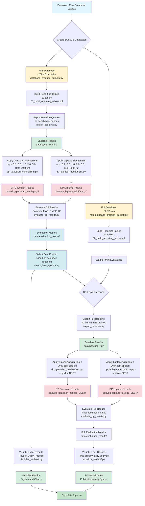

# intel-telemetry-capstone

**Team & Mentor:** 
| Name             | Role    | GitHub       |
|------------------|---------|--------------|
| Dhruv Patel      | Student | [@PDhruv09](https://github.com/PDhruv09)       |
| Reva Agrawal     | Student | [@agrawalreva](https://github.com/agrawalreva) |
| Jordan Lambino   | Student | [@jordanlambino](https://github.com/jordanlambino)  |
| Yu-Xiang Wang    | Advisor | [@yuxiangw](https://github.com/yuxiangw)|

A complete data pipeline for implementing and evaluating differential privacy mechanisms on Intel system telemetry data, from raw data acquisition through privacy-preserving analytics.

## Table of Contents

- [Overview](#overview)
- [Repository Structure](#repository-structure)
- [Prerequisites](#prerequisites)
- [Environment Setup](#environment-setup)
- [Quick Start Guide](#quick-start-guide)
- [Pipeline Architecture](#pipeline-architecture)
- [Build Instructions](#build-instructions)
- [Usage Examples](#usage-examples)
- [Troubleshooting](#troubleshooting)
- [Contributing](#contributing)
- [License](#license)

---

## Overview

This project implements a complete differential privacy pipeline for analyzing Intel telemetry data. The pipeline supports:

- **Data ingestion** from Globus endpoints
- **Database creation** with DuckDB (full and sampled versions)
- **Reporting layer** with 22 pre-aggregated analytics tables
- **Differential privacy mechanisms** (Laplace, Gaussian)
- **Privacy-utility evaluation** framework
- **22 benchmark queries** for testing DP mechanisms

**Note**: The database our analsis was completed on is confidential, so only the resulting plots are available. You may run the project on a synthetic demo dataset with argument test

### Key Features

✅ **Two-branch development strategy** - Fast iteration on subsample, production runs on full data  
✅ **Flexible privacy budgets** - Test multiple epsilon values (0.1 to 10.0)  
✅ **Comprehensive evaluation** - Accuracy metrics, visualizations, statistical tests  
✅ **Production-ready code** - Idempotent scripts, error handling, logging  
✅ **Well-documented** - Inline comments, architecture diagrams, usage examples  

---

## Repository Structure

```
differential-privacy-pipeline/
│
├── README.md                          # This file - build instructions
├── DATABASE_DOCUMENTATION.md          # Detailed database architecture
├── requirements.txt                   # Python dependencies
├── environment.yml                    # Conda environment specification
│
├── data/                              # Data directory (git ignored)
│   ├── baseline_mini/                # Baseline query results (subsample)
│   ├── baseline_full/                # Baseline query results (full)
│   ├── dp_gaussian_mini/             # Gaussian DP results (subsample)
│   │   ├── eps_0.1/                  # ε=0.1 (strong privacy)
│   │   ├── eps_0.5/                  # ε=0.5
│   │   ├── eps_1.0/                  # ε=1.0
│   │   ├── eps_2.0/                  # ε=2.0 (default)
│   │   ├── eps_5.0/                  # ε=5.0
│   │   ├── eps_10.0/                 # ε=10.0
│   │   ├── eps_20.0/                 # ε=20.0 (weak privacy)
│   │   └── eps_inf/                  # ε=∞ (no noise baseline)
│   ├── dp_gaussian_full/             # Gaussian DP results (full)
│   ├── dp_laplace_mini/              # Laplace DP results (subsample)
│   ├── dp_laplace_full/              # Laplace DP results (full)
│   └── evaluation_results/           # Evaluation outputs
│       ├── gaussian_mini_evaluation.csv
│       ├── laplace_mini_evaluation.csv
│       └── figures/
│
├── scripts/                           # Python scripts
│   ├── export_baseline.py            # Export query results to CSV
│   ├── dp_mechanisms/                # ⭐ DP mechanisms package
│   │   ├── __init__.py
│   │   ├── dp_config.py              # Shared configuration
│   │   ├── dp_gaussian_mechanism.py  # Gaussian (ε,δ)-DP
│   │   └── dp_laplace_mechanism.py   # Laplace ε-DP
│   └── evaluation/                   # ⭐ Evaluation scripts (coming soon)
│       ├── evaluate_dp_results.py
│       ├── select_best_epsilon.py
│       └── visualize_tradeoff.py
│
├── sql/                               # SQL scripts
│   ├── 00_build_reporting_tables.sql # Build 22 reporting tables
│   ├── 01_validation.sql             # Validate data quality
│   └── 02_analysis_queries.sql       # 22 benchmark queries
│
├── docs/                              # Additional documentation
│   ├── COMPLETE_DP_PIPELINE.md       # End-to-end pipeline guide
│   ├── TWO_BRANCH_PIPELINE.md        # Two-branch strategy details
│   ├── FIX_CSV_ERROR.md              # Troubleshooting guide
│   └── FIX_COLUMN_NAME.md            # Data quality issues
│
├── notebooks/                         # Jupyter notebooks (optional)
│   ├── 01_exploratory_analysis.ipynb
│   ├── 02_dp_mechanism_testing.ipynb
│   └── 03_final_evaluation.ipynb
│
└── results/                           # Generated outputs (not in git)
    ├── evaluation_mini/              # Subsample evaluation results
    ├── evaluation_full/              # Full database evaluation results
    └── figures/                      # Generated plots and visualizations
```

### Files Not in Repository (Git Ignored)

The following large files/folders are excluded from version control via `.gitignore`:

```
data/
*.duckdb
*.duckdb.wal
*.csv
results/
__pycache__/
*.pyc
.ipynb_checkpoints/
```

---

## Prerequisites

### System Requirements

- **Operating System**: Windows 10/11, Linux, or macOS
- **RAM**: 8 GB minimum, 16+ GB recommended for full database
- **Disk Space**: 
  - Subsample database: ~5 GB
  - Full database: ~60 GB
  - Raw data files: ~40 GB
- **Python**: 3.8 or higher
- **DuckDB**: 0.9.0 or higher

### Required Software

1. **Python 3.8+**
   - Download: https://www.python.org/downloads/
   - Verify: `python --version`

2. **DuckDB**
   - Download: https://duckdb.org/docs/installation/
   - Verify: `duckdb --version`

3. **Git** (for cloning repository)
   - Download: https://git-scm.com/downloads
   - Verify: `git --version`

4. **Globus Connect** (for data download)
   - Download: https://www.globus.org/globus-connect-personal
   - Requires institutional account

---

## Environment Setup

### Option 1: Using Conda (Recommended)

Conda provides isolated environments and handles dependencies automatically.

#### Step 1: Install Miniconda/Anaconda

If you don't have conda installed:

**Windows:**
```bash
# Download and install Miniconda
# https://docs.conda.io/en/latest/miniconda.html
```

**Linux/Mac:**
```bash
wget https://repo.anaconda.com/miniconda/Miniconda3-latest-Linux-x86_64.sh
bash Miniconda3-latest-Linux-x86_64.sh
```

#### Step 2: Create Conda Environment

```bash
# Create environment from specification file
conda env create -f environment.yml

# Activate the environment
conda activate dp-pipeline

# Verify installation
python --version
python -c "import duckdb; print(duckdb.__version__)"
```

#### Step 3: Install Additional Dependencies

```bash
# If needed, install additional packages
conda install -c conda-forge jupyter matplotlib seaborn
```

### Option 2: Using pip + virtualenv

If you prefer pip over conda:

#### Step 1: Create Virtual Environment

**Windows:**
```bash
# Create virtual environment
python -m venv venv

# Activate environment
venv\Scripts\activate
```

**Linux/Mac:**
```bash
# Create virtual environment
python3 -m venv venv

# Activate environment
source venv/bin/activate
```

#### Step 2: Install Dependencies

```bash
# Upgrade pip
pip install --upgrade pip

# Install requirements
pip install -r requirements.txt

# Verify installation
python -c "import duckdb; print(duckdb.__version__)"
```

### Environment Files

**`environment.yml`** (for conda):
```yaml
name: dp-pipeline
channels:
  - conda-forge
  - defaults
dependencies:
  - python=3.10
  - duckdb=0.9.2
  - pandas=2.0.3
  - numpy=1.24.3
  - matplotlib=3.7.2
  - seaborn=0.12.2
  - scipy=1.11.1
  - jupyter=1.0.0
  - pytest=7.4.0
  - pip
  - pip:
    - scikit-learn==1.3.0
```

**`requirements.txt`** (for pip):
```
duckdb==0.9.2
pandas==2.0.3
numpy==1.24.3
matplotlib==3.7.2
seaborn==0.12.2
scipy==1.11.1
scikit-learn==1.3.0
jupyter==1.0.0
pytest==7.4.0
```
# Differential Privacy Pipeline

## Pipeline Overview
