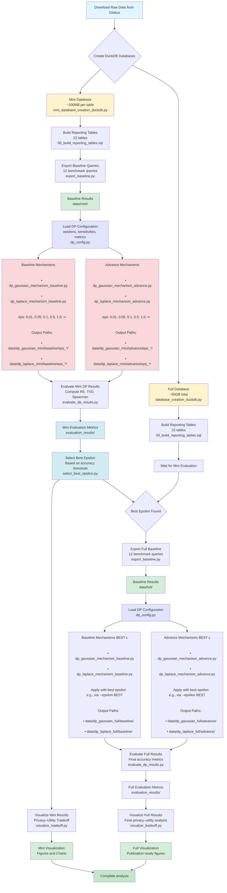

# intel-telemetry-capstone

**Team & Mentor:** 
| Name             | Role    | GitHub       |
|------------------|---------|--------------|
| Dhruv Patel      | Student | [@PDhruv09](https://github.com/PDhruv09)       |
| Reva Agrawal     | Student | [@agrawalreva](https://github.com/agrawalreva) |
| Jordan Lambino   | Student | [@jordanlambino](https://github.com/jordanlambino)  |
| Yu-Xiang Wang    | Advisor | [@yuxiangw](https://github.com/yuxiangw)|
| Bijan Arbab      | Industry Advisor | [barbab@ucsd.edu](barbab@ucsd.edu)|

A complete data pipeline for implementing and evaluating differential privacy mechanisms on Intel system telemetry data, from raw data acquisition through privacy-preserving analytics. You can find more @ [intel-telemetry-capstone](https://agrawalreva.github.io/intel-telemetry-capstone/)

## Table of Contents

- [Overview](#overview)
- [Repository Structure](#repository-structure)
- [Prerequisites](#prerequisites)
- [Environment Setup](#environment-setup)
- [Pipeline Architecture](#pipeline-architecture)
- [Script Reference](#script-reference)
- [Build Instructions](#build-instructions)
- [Differential Privacy Mechanisms](#differential-privacy-mechanisms)
- [Evaluation Framework](#evaluation-framework)
- [Usage Examples](#usage-examples)
- [Troubleshooting](#troubleshooting)
- [Contributing](#contributing)

---

## Overview

This project implements a complete differential privacy pipeline for analyzing Intel telemetry data. The pipeline supports:

- **Data ingestion** from Globus endpoints
- **Database creation** with DuckDB (full and sampled versions)
- **Reporting layer** with 22 pre-aggregated analytics tables
- **Differential privacy mechanisms** (Laplace and Gaussian), applied directly to query-level aggregates
- **Per-query evaluation metrics** — each query uses the metric that best captures its analytical story (RE, TVD, Spearman ρ)
- **Privacy-utility evaluation** framework with epsilon selection
- **12 benchmark queries** for testing DP mechanisms

**Note**: The database our analsis was completed on is confidential, so only the resulting plots are available. You may run the project on a synthetic demo dataset with argument test

### Key Features

- **Two-branch development strategy** — baseline and advance variants for fast iteration and optimised production runs  
- **Epsilon grid** — 6 values from 0.01 to ∞ for a smooth privacy-utility curve  
- **Per-query evaluation metrics** — metric chosen to align with the shared evaluation framework (RE, TVD, Spearman ρ)  
- **Analytic Gaussian calibration** — uses Balle & Wang (2018) tight sigma calibration (10–30% less noise vs. classic formula)  
- **Reproducible results** — fixed seeded for-loop, same pattern as the telemetry project  
- **Production-ready code** — idempotent scripts, error handling, logging  
- **Well-documented** — inline comments, architecture diagrams, usage examples  

---

## Repository Structure

```
intel-telemetry-capstone/
│
├── README.md                          # Project overview and build instructions
├── requirements.txt                   # Python package dependencies
├── environment.yml                    # Conda environment specification
├── index.md                           # Documentation entry point
├── _config.yml                        # Site/configuration settings
│
├── data/                              # All raw and intermediate data artifacts (git-ignored)
│   │
│   ├── mini/                          # Baseline query outputs — subsample
│   │   │                              # (committed: 12 dummy CSVs, 100 rows each)
│   │   ├── battery_power_on_geographic_summary.csv
│   │   ├── battery_on_duration_by_cpu_family_and_generation.csv
│   │   ├── display_devices_connection_type_resolution_durations.csv
│   │   └── ...  (12 files total, one per benchmark query)
│   │
│   ├── full/                          # Baseline query outputs — full dataset
│   │   │                              # (committed: 12 dummy CSVs, 100 rows each)
│   │   └── ...  (same filenames as mini/)
│   │
│   ├── dp_gaussian_mini/              # Gaussian DP outputs — subsample (git-ignored)
│   │   ├── baseline/
│   │   │   ├── eps_0.01/
│   │   │   ├── eps_0.05/
│   │   │   ├── eps_0.1/
│   │   │   ├── eps_0.5/
│   │   │   ├── eps_1.0/
│   │   │   ├── eps_inf/
│   │   │   └── gaussian_metric_summary.csv
│   │   └── advance/
│   │       └── gaussian_metric_summary.csv
│   │
│   ├── dp_gaussian_full/              # Gaussian DP outputs — full dataset (git-ignored)
│   │   ├── baseline/
│   │   └── advance/
│   │
│   ├── dp_laplace_mini/               # Laplace DP outputs — subsample (git-ignored)
│   │   ├── baseline/
│   │   └── advance/
│   │
│   └── dp_laplace_full/               # Laplace DP outputs — full dataset (git-ignored)
│       ├── baseline/
│       └── advance/
│
├── evaluation_results/                # Evaluation summaries and visualizations
│   ├── baseline/
│   │   ├── evaluation_summary_mini.csv
│   │   ├── per_query_comparison_mini.csv
│   │   ├── best_epsilon_report_mini.csv
│   │   ├── figures_mini/
│   │   └── figures_full/
│   └── advance/
│       ├── evaluation_summary_mini.csv
│       ├── per_query_comparison_mini.csv
│       ├── best_epsilon_report_mini.csv
│       ├── figures_mini/
│       │   ├── 01_privacy_utility_curves_mini.png
│       │   ├── 02_heatmap_<metric>_mini.png
│       │   ├── 03_mechanism_comparison_mini.png
│       │   ├── 04_pass_rate_mini.png
│       │   ├── 05_best_epsilon_summary_mini.png
│       │   └── 06_pareto_frontier_mini.png
│       └── figures_full/
│           ├── 03_mechanism_comparison_full.png
│           ├── 04_pass_rate_full.png
│           ├── 05_mini_vs_full_<mechanism>.png
│           └── 06_pareto_frontier_full.png
│
├── src/                               # All Python source code
│   │
│   ├── export_baseline.py             # Runs benchmark queries and exports baseline CSVs
│   ├── create_clipped_dummy_datasets.py  # Generates synthetic 100-row CSVs for mini/ and full/
│   │
│   ├── dp_mechanisms/                 # Differential privacy mechanism implementations
│   │   ├── __init__.py
│   │   ├── dp_config.py               # Shared configuration: epsilons, sensitivities, metrics
│   │   ├── dp_gaussian_mechanism_baseline.py   # Standard Gaussian (ε, δ)-DP
│   │   ├── dp_gaussian_mechanism_advance.py    # Optimised Gaussian DP with sigma caching
│   │   ├── dp_laplace_mechanism_baseline.py    # Standard Laplace ε-DP
│   │   └── dp_laplace_mechanism_advance.py     # Optimised Laplace DP
│   │
│   └── evaluation/                    # Evaluation and visualization utilities
│       ├── evaluate_dp_results.py     # Computes metrics across epsilons
│       ├── select_best_epsilon.py     # Identifies best epsilon per query/metric
│       └── visualize_tradeoff.py      # Generates privacy–utility tradeoff plots
│
├── sql/                               # SQL scripts for database construction and queries
│   ├── 00_build_reporting_tables.sql  # Builds 22 reporting tables
│   ├── 01_validation.sql              # Data validation checks
│   └── 02_analysis_queries.sql        # Benchmark analysis queries
│
├── database/                          # Database creation scripts
│   ├── database_creation_duckdb.py    # Builds full DuckDB database
│   └── mini_database_creation_duckdb.py  # Builds subsample DuckDB database
│
├── dummy/                             # Additional placeholder data for testing
├── query exploration/                 # Notes and exploratory SQL used during analysis
├── report/                            # Final written findings
├── poster/                            # Poster of the presentation
├── website/                           # Website of our project
├── roadmap/                           # Project timeline and development roadmap
│
├── test/                              # Unit tests
│   └── test_dp.py                     # Tests for DP mechanisms
│
└── assets/                            # Static assets for documentation/UI
    └── css/
        └── style.css
```

### What Is and Is Not in the Repository

The dummy baseline CSVs in `data/mini/` and `data/full/` are **committed** to the repository so the pipeline can be tested without access to the confidential Intel database. All generated DP outputs for specific epsilon and the full/subsample DuckDB files are git-ignored:

```
data/
*.duckdb
*.duckdb.wal
__pycache__/
*.pyc
.ipynb_checkpoints/
```

---

## Prerequisites

### System Requirements

| Requirement | Minimum | Recommended |
|-------------|---------|-------------|
| OS | Windows 10/11, Linux, macOS | Linux or macOS |
| RAM | 8 GB | 16+ GB |
| Disk (subsample) | 10 GB | 20 GB |
| Disk (full database) | 80 GB | 120 GB |
| Python | 3.8 | 3.10 |

### Required Software

1. **Python 3.8+**
   - Download: https://www.python.org/downloads/
   - Verify: `python --version`

2. **DuckDB**
   - Download: https://duckdb.org/docs/installation/
   - Verify: `duckdb --version`

3. **Git** (for cloning repository)
   - Download: https://git-scm.com/downloads
   - Verify: `git --version`

4. **Globus Connect** (for data download)
   - Download: https://www.globus.org/globus-connect-personal
   - Requires institutional account

---

## Environment Setup

### Option 1: Using Conda (Recommended)

Conda provides isolated environments and handles dependencies automatically.

#### Step 1: Install Miniconda/Anaconda

If you don't have conda installed:

**Windows:**
```bash
# Download and install Miniconda
# https://docs.conda.io/en/latest/miniconda.html
```

**Linux/Mac:**
```bash
wget https://repo.anaconda.com/miniconda/Miniconda3-latest-Linux-x86_64.sh
bash Miniconda3-latest-Linux-x86_64.sh
```

#### Step 2: Create Conda Environment

```bash
# Create environment from specification file
conda env create -f environment.yml

# Activate the environment
conda activate dp-pipeline

# Verify installation
python --version
python -c "import duckdb; print(duckdb.__version__)"
```

#### Step 3: Install Additional Dependencies

```bash
# If needed, install additional packages
conda install -c conda-forge jupyter matplotlib seaborn
```

### Option 2: Using pip + virtualenv

If you prefer pip over conda:

#### Step 1: Create Virtual Environment

**Windows:**
```bash
# Create virtual environment
python -m venv venv

# Activate environment
venv\Scripts\activate
```

**Linux/Mac:**
```bash
# Create virtual environment
python3 -m venv venv

# Activate environment
source venv/bin/activate
```

#### Step 2: Install Dependencies

```bash
# Upgrade pip
pip install --upgrade pip

# Install requirements
pip install -r requirements.txt

# Verify installation
python -c "import duckdb; print(duckdb.__version__)"
```

### Environment Files

**`environment.yml`** (for conda):
```yaml
name: dp-pipeline
channels:
  - conda-forge
  - defaults
dependencies:
  - python=3.10
  - duckdb=0.9.2
  - pandas=2.0.3
  - numpy=1.24.3
  - matplotlib=3.7.2
  - seaborn=0.12.2
  - scipy=1.11.1
  - jupyter=1.0.0
  - pytest=7.4.0
  - pip
  - pip:
    - scikit-learn==1.3.0
```

**`requirements.txt`** (for pip):
```
duckdb==0.9.2
pandas==2.0.3
numpy==1.24.3
matplotlib==3.7.2
seaborn==0.12.2
scipy==1.11.1
scikit-learn==1.3.0
jupyter==1.0.0
pytest==7.4.0
```
# Differential Privacy Pipeline

## Pipeline Overview

```mermaid
graph TD
    A[Download Raw Data from Globus] --> B{Create DuckDB Databases}

    B --> C[Mini Database<br/>~200MB per table<br/>mini_database_creation_duckdb.py]
    B --> D[Full Database<br/>~50GB total<br/>database_creation_duckdb.py]

    C --> E[Build Reporting Tables<br/>22 tables<br/>00_build_reporting_tables.sql]
    D --> F[Build Reporting Tables<br/>22 tables<br/>00_build_reporting_tables.sql]

    E --> G[Export Baseline Queries<br/>12 benchmark queries<br/>export_baseline.py]
    F --> H[Wait for Mini Evaluation]

    G --> I[Baseline Results<br/>data/mini/]

    %% CONFIG BEFORE SPLIT
    I --> CFG[Load DP Configuration<br/>epsilons, sensitivities, metrics<br/>dp_config.py]

    %% MINI — BASELINE BRANCH
    CFG --> B_MIN[Baseline Mechanisms<br/><br/>
        • dp_gaussian_mechanism_baseline.py<br/>
        • dp_laplace_mechanism_baseline.py<br/><br/>
        eps: 0.01, 0.05, 0.1, 0.5, 1.0, ∞<br/><br/>
        Output Paths:<br/>
        • data/dp_gaussian_mini/baseline/eps_*/<br/>
        • data/dp_laplace_mini/baseline/eps_*/]

    %% MINI — ADVANCE BRANCH
    CFG --> A_MIN[Advance Mechanisms<br/><br/>
        • dp_gaussian_mechanism_advance.py<br/>
        • dp_laplace_mechanism_advance.py<br/><br/>
        eps: 0.01, 0.05, 0.1, 0.5, 1.0, ∞<br/><br/>
        Output Paths:<br/>
        • data/dp_gaussian_mini/advance/eps_*/<br/>
        • data/dp_laplace_mini/advance/eps_*/]

    %% MINI EVALUATION
    B_MIN --> N
    A_MIN --> N

    N[Evaluate Mini DP Results<br/>Compute RE, TVD, Spearman<br/>evaluate_dp_results.py] --> O

    O[Mini Evaluation Metrics<br/>evaluation_results/] --> P

    P[Select Best Epsilon<br/>Based on accuracy threshold<br/>select_best_epsilon.py] --> Q

    Q[Visualize Mini Results<br/>Privacy–Utility Tradeoff<br/>visualize_tradeoff.py] --> R[Mini Visualization<br/>Figures and Charts]

    P --> S{Best Epsilon Found}
    H --> S

    %% FULL — BASELINE + ADVANCE, BEST EPSILON ONLY
    S --> T[Export Full Baseline<br/>12 benchmark queries<br/>export_baseline.py]

    T --> U[Baseline Results<br/>data/full/]

    U --> CFG2[Load DP Configuration<br/>dp_config.py]

    %% FULL — BASELINE BRANCH
    CFG2 --> B_FULL[Baseline Mechanisms BEST ε<br/><br/>
        • dp_gaussian_mechanism_baseline.py<br/>
        • dp_laplace_mechanism_baseline.py<br/><br/>
        Apply with best epsilon<br/>e.g., via --epsilon BEST<br/><br/>
        Output Paths:<br/>
        • data/dp_gaussian_full/baseline/<br/>
        • data/dp_laplace_full/baseline/]

    %% FULL — ADVANCE BRANCH
    CFG2 --> A_FULL[Advance Mechanisms BEST ε<br/><br/>
        • dp_gaussian_mechanism_advance.py<br/>
        • dp_laplace_mechanism_advance.py<br/><br/>
        Apply with best epsilon<br/>e.g., via --epsilon BEST<br/><br/>
        Output Paths:<br/>
        • data/dp_gaussian_full/advance/<br/>
        • data/dp_laplace_full/advance/]

    %% FULL EVALUATION
    B_FULL --> Z
    A_FULL --> Z

    Z[Evaluate Full Results<br/>Final accuracy metrics<br/>evaluate_dp_results.py] --> AA

    AA[Full Evaluation Metrics<br/>evaluation_results/] --> AB

    AB[Visualize Full Results<br/>Final privacy–utility analysis<br/>visualize_tradeoff.py] --> AC[Full Visualization<br/>Publication-ready figures]

    R --> AD[Complete analysis]
    AC --> AD

    %% COLORS
    style A fill:#e1f5ff
    style C fill:#fff3cd
    style D fill:#fff3cd
    style I fill:#d4edda
    style CFG fill:#e2e3ff
    style B_MIN fill:#f8d7da
    style A_MIN fill:#f8d7da
    style O fill:#d1ecf1
    style P fill:#d1ecf1
    style R fill:#d4edda
    style U fill:#d4edda
    style CFG2 fill:#e2e3ff
    style AC fill:#d4edda
    style AD fill:#c3e6cb
```
--

## Script Reference

The scripts in this project tell a single story: *can we add mathematically guaranteed privacy noise to Intel telemetry analytics while keeping the results useful?* Each script plays a specific role in that story, and they are designed to run in sequence.

It starts with data - either real telemetry exported from DuckDB, or the synthetic dummy CSVs committed in this repository. Those clean query results become the baseline: the unperturbed truth we are trying to protect. From there, two DP mechanisms (Gaussian and Laplace) each independently add calibrated noise across a range of privacy budgets (epsilon values), producing dozens of "what if we had privatised this?" versions of every query. The evaluation scripts then measure how badly each version drifted from the truth, identify the strongest privacy setting that still keeps results within an acceptable range, and finally render the full privacy-utility tradeoff as a set of publication-ready figures.

The complete written analysis — including findings, design decisions, and interpretation of results — lives in the **`report/`** folder at the repo root.

---

### `src/create_clipped_dummy_datasets.py`

Generates synthetic 100-row CSV files that exactly mirror the schema of every real benchmark query output. It writes one set of files to `data/mini/` and another to `data/full/`, so the entire DP pipeline can be exercised without access to the confidential Intel database.

Each dummy CSV uses the same column names, data types, and realistic value ranges as the real data (e.g. country codes, CPU family names, percentage columns that sum to 100, power values within capped ranges). This means all downstream scripts — the DP mechanisms, evaluator, epsilon selector, and visualizer — accept the dummy files without any modification.

Run this once after cloning if you do not have access to Globus:

```bash
# From repo root
python src/create_clipped_dummy_datasets.py
# Writes: data/mini/.csv  (12 files, 100 rows each)
#         data/full/.csv  (12 files, 100 rows each)
```

> **Note:** The dummy data is already committed in `data/mini/` and `data/full/`, so you only need to re-run this script if you want to regenerate fresh random data or have deleted the committed files.

---

### `src/export_baseline.py`

Connects to the DuckDB database, runs all 12 benchmark SQL queries, and writes each result as a CSV into `data/mini/` (or `data/full/`). These CSVs are the clean, unperturbed baseline that every DP mechanism reads as its input. Each file is named after its query (e.g. `battery_power_on_geographic_summary.csv`). Run this once before running any DP mechanism script.

---

### `src/dp_mechanisms/dp_config.py`

The single source of truth for all DP parameters. It defines:
- **EPSILON_VALUES** — the 6 epsilon values tested across all queries (`[0.01, 0.05, 0.1, 0.5, 1.0, inf]`)
- **DEFAULT_DELTA** — `1e-6`, used only by the Gaussian mechanism
- **QUERY_META** — a dictionary keyed by query number containing the filename, numeric columns to perturb, grouping columns, metric type (`RE`, `TVD`, or `SPEARMAN`), and per-column sensitivity values
- **Clipping caps** — upper bounds on per-GUID contributions used to compute global sensitivity (e.g. `CAP_DUR_MINS = 60.0`, `CAP_SECONDS = 600.0`)
- **Helper functions** — `get_l1_sensitivity()`, `get_l2_sensitivity()`, `gaussian_sigma()`, `laplace_scale()`, and `build_output_dir()` used by all mechanism files

Editing this file is the only change needed to adjust epsilon values, sensitivities, or add new queries.

---

### `src/dp_mechanisms/dp_gaussian_mechanism_baseline.py` / `dp_gaussian_mechanism_advance.py`

Both files implement the **Gaussian (ε, δ)-DP** mechanism applied to the 12 benchmark query CSVs. For each query and each epsilon, they add independent Gaussian noise `N(0, σ²)` to every numeric column, post-process the result (clamp negatives to zero, re-normalise percentage columns), compute the true and DP metric values, and save the noisy CSV plus a running metric summary.

The **baseline** variant recomputes σ via binary-search analytic calibration (Balle & Wang 2018) for every `(query, column, ε)` triple. The **advance** variant pre-builds a `sigma_cache` keyed on `(sensitivity, ε)` before the loops begin, so each unique sensitivity/epsilon pair runs the binary search exactly once — making it roughly 2–4× faster with identical mathematical output.

Both write results to `data/dp_gaussian_{mini|full}/{baseline|advance}/eps_{value}/` and produce a single `gaussian_metric_summary.csv` summarising every `(query, epsilon, metric)` row.

---

### `src/dp_mechanisms/dp_laplace_mechanism_baseline.py` / `dp_laplace_mechanism_advance.py`

Identical pipeline structure to the Gaussian files but implementing **pure Laplace ε-DP**. Noise is drawn from `Laplace(0, b)` where `b = Δ₁ / ε` (L1 sensitivity divided by epsilon). Because the Laplace mechanism provides pure ε-DP (no δ required), the noise scale formula is closed-form and no binary search is needed. The advance variant still caches Laplace scales for the same speed benefit when many queries share the same sensitivity.

Output mirrors the Gaussian structure: `data/dp_laplace_{mini|full}/{baseline|advance}/eps_{value}/` and `laplace_metric_summary.csv`.

---

### `src/evaluation/evaluate_dp_results.py`

Reads the `gaussian_metric_summary.csv` and `laplace_metric_summary.csv` produced by the mechanism files and computes **per-query performance statistics** across all epsilon values. For each `(query, mechanism)` pair it reports:

- **worst_value / worst_epsilon** — the epsilon where the metric degrades most
- **best_value / best_epsilon** — the epsilon with the best metric (usually ε=∞, the no-noise baseline)
- **baseline_value** — the metric value at ε=∞, used as the reference for adaptive thresholding
- **mean / std across epsilons** — overall spread of performance
- **n_pass_hard / frac_eps_passing** — how many epsilon values pass the shared evaluation framework's fixed threshold (RE ≤ 0.25, TVD ≤ 0.15, Spearman ρ ≥ 0.50)
- **adaptive_threshold / n_pass_adaptive** — a second pass criterion set at 90% of each query's own baseline value, so noisy but inherently difficult queries are not penalised unfairly

It also builds a **Gaussian vs. Laplace comparison table** by merging both summaries on `(query_num, epsilon)`, computing the difference in primary metric value, and recording a winner for each pair.

**Outputs written to `evaluation_results/{variant}/`:**
- `evaluation_summary_{database}.csv` — one row per `(query, mechanism)` with all statistics above
- `per_query_comparison_{database}.csv` — one row per `(query, epsilon)` with head-to-head Gaussian vs. Laplace

```
Arguments:
  --database  mini | full
  --variant   baseline | advance
```

---

### `src/evaluation/select_best_epsilon.py`

Reads `evaluation_summary_{database}.csv` and picks **one best epsilon per mechanism** (Gaussian and Laplace separately) using a relative utility-preservation score rather than a fixed absolute threshold. For each finite epsilon ≤ 1.0, it computes how much of each query's baseline utility is retained:

- **RE / TVD** (lower is better): `utility_preserved = 1 − (current − baseline) / |baseline|`
- **SPEARMAN** (higher is better): `utility_preserved = 1 − (baseline − current) / |baseline|`

It then averages these scores across all 12 queries and selects using two tiers:
1. **Tier 1** — the smallest ε where `mean_utility_preserved ≥ 0.80` (strongest privacy that still keeps 80% of utility)
2. **Tier 2** — if nothing reaches 0.80, fall back to the epsilon with the highest score

A **near-miss flag** is set if the next-smaller epsilon is within 5% of the threshold, making it easy to spot cases where a slightly stronger privacy guarantee is almost achievable.

**Output:** `evaluation_results/{variant}/best_epsilon_report_{database}.csv` — two rows (one per mechanism) with `best_epsilon`, `mean_utility_preserved`, `min_utility_preserved`, runner-up details, and the near-miss flag.

```
Arguments:
  --database  mini | full
  --variant   baseline | advance
```

---

### `src/evaluation/visualize_tradeoff.py`

Reads the mechanism metric summaries and the best-epsilon report and generates **6 publication-ready figures** per `(database, variant)` combination, saved to `evaluation_results/{variant}/figures_{database}/`:

| Figure | What It Shows |
|--------|---------------|
| `01_privacy_utility_curves_{database}.png` | Privacy-utility curves — one panel per metric type (RE, TVD, Spearman ρ) with both mechanisms plotted against ε |
| `02_heatmap_{metric}_{database}.png` | Query × epsilon heatmaps for each metric type — shows which queries degrade at which ε |
| `03_mechanism_comparison_{database}.png` | Side-by-side bar charts comparing Gaussian vs. Laplace at every epsilon |
| `04_pass_rate_{database}.png` | Fraction of queries passing the hard threshold (RE ≤ 0.25 / TVD ≤ 0.15 / ρ ≥ 0.50) at each ε |
| `05_best_epsilon_summary_{database}.png` | Dot plot showing each query's individually selected best epsilon for both mechanisms |
| `06_pareto_frontier_{database}.png` | Privacy gain (smaller ε = more private) vs. utility loss scatter — helps identify the practical operating point |

When `best_epsilon_report_{database}.csv` exists, vertical marker lines are overlaid on all privacy-utility curves to show where the selected epsilon falls.

```
Arguments:
  --database  mini | full
  --variant   baseline | advance
```

> **Further reading:** The full written analysis of these results — findings, design rationale, and interpretation of the tradeoff figures — is in the **`report/`** folder at the repo root.

---

## Build Instructions

### Phase 1A: Quick Start with Dummy Data (No Globus Access Required)

The repository ships with pre-generated 100-row dummy CSVs in `data/mini/` and `data/full/` that match the schema of every real benchmark query. This lets you run and validate the entire pipeline without the Intel database.

```bash
# From repo root — dummy data is already committed, nothing to generate.
# If you need to regenerate it (e.g. after deleting the files):
python src/create_clipped_dummy_datasets.py
# Writes: data/mini/*.csv and data/full/*.csv  (12 files × 2 folders, 100 rows each)
```

Skip to **Phase 5** once dummy data is confirmed present in `data/mini/` and `data/full/`.

---

### Phase 1B: Real Data via Globus

Download raw telemetry data via Globus. Contact the project advisor for endpoint credentials. Full database is ~60 GB; subsample is ~5 GB.

---

### Phase 2: Create DuckDB Databases

> **Skip this phase if using dummy data** — the mechanism scripts read directly from `data/mini/` and `data/full/` CSVs and do not require a DuckDB database file.

```bash
# From repo root
# Subsample (mini) database — use for all development and evaluation
python database/mini_database_creation_duckdb.py

# Full database — only needed for the production run after best ε is selected
python database/database_creation_duckdb.py
```

---

### Phase 3: Build Reporting Tables

> **Skip this phase if using dummy data.**

```bash
duckdb data/mini.duckdb
# Inside the DuckDB shell:
# .read sql/00_build_reporting_tables.sql
# .quit
```

---

### Phase 4: Export Baseline Queries

> **Skip this phase if using dummy data** — `data/mini/` and `data/full/` are already populated.

Runs all 12 benchmark queries against the DuckDB database and writes clean CSVs used as input by every DP mechanism.

```bash
cd src
python export_baseline.py
# Outputs: data/mini/.csv  (12 files)
```

---

### Phase 5: Apply DP Mechanisms (Mini — All Variants)

Run all four mechanism files against the subsample. Both `baseline` and `advance` must be run so that `evaluate_dp_results.py` and `select_best_epsilon.py` can compare them. Each script loops over all 6 epsilon values and saves 12 noisy CSVs per epsilon plus a metric summary CSV.

```bash
cd src/dp_mechanisms

# Run dp_config.py first — validates all sensitivity values, clipping caps,
# and epsilon grid, and confirms output directories can be created
python dp_config.py

python dp_gaussian_mechanism_baseline.py --database mini && \
python dp_laplace_mechanism_baseline.py  --database mini && \
python dp_gaussian_mechanism_advance.py  --database mini && \
python dp_laplace_mechanism_advance.py   --database mini

# Output per mechanism/variant:
#   12 queries × 6 epsilon values = 72 rows per CSV files
#   all metric summary CSV  (e.g. gaussian_metric_summary.csv/laplace_metric_summary)
# Time: ~2–5 minutes per script
```

---

### Phase 6: Evaluate Both Variants (Mini)

Reads the metric summaries and computes per-query statistics, pass rates, and a Gaussian vs. Laplace comparison table for both variants.

```bash
cd src/evaluation

python evaluate_dp_results.py --database mini --variant baseline && \
python evaluate_dp_results.py --database mini --variant advance
```

---

### Phase 7: Select Best Epsilon (Mini)

Scores each epsilon by relative utility preservation and selects the strongest epsilon that keeps mean utility above 80% of baseline. Run for both variants so you can compare their selections.

```bash
# (still in src/evaluation)

python select_best_epsilon.py --database mini --variant baseline && \
python select_best_epsilon.py --database mini --variant advance
```

Check `evaluation_results/baseline/best_epsilon_report_mini.csv` and `evaluation_results/advance/best_epsilon_report_mini.csv` to see the selected epsilons. The example commands below use `1.0` for baseline and `0.5` for advance — **replace these with the values from your own reports**.

---

### Phase 8: Production Run (Full Database — Best ε Only)

Apply only the selected best epsilon to the full dataset. Running the full grid on the large database is unnecessary since the best ε was already identified on mini.

```bash
# First, build reporting tables and export baseline on the full database:
duckdb data/data.duckdb
# .read sql/00_build_reporting_tables.sql
# .quit

cd src
python export_baseline.py   # update DATABASE_PATH inside the file to data/data.duckdb

# Run mechanisms with the best epsilon selected in Phase 7
cd src/dp_mechanisms

python dp_config.py

python dp_gaussian_mechanism_baseline.py --database full --epsilon 1.0 && \
python dp_gaussian_mechanism_advance.py  --database full --epsilon 0.5 && \
python dp_laplace_mechanism_baseline.py  --database full --epsilon 1.0 && \
python dp_laplace_mechanism_advance.py   --database full --epsilon 0.5
```

---

### Phase 9: Evaluate Full Database Results

```bash
cd src/evaluation

python evaluate_dp_results.py --database full --variant baseline && \
python evaluate_dp_results.py --database full --variant advance
```

---

### Phase 10: Visualize All Results

Generate all 6 figures for every combination of database and variant in one chained command.

```bash
# (still in src/evaluation)

python visualize_tradeoff.py --database mini --variant baseline && \
python visualize_tradeoff.py --database mini --variant advance && \
python visualize_tradeoff.py --database full --variant baseline && \
python visualize_tradeoff.py --database full --variant advance

# Figures saved to:
#   evaluation_results/baseline/figures_mini/
#   evaluation_results/advance/figures_mini/
#   evaluation_results/baseline/figures_full/
#   evaluation_results/advance/figures_full/
```

---

## Differential Privacy Mechanisms

### Overview

Both mechanisms are implemented **by hand** (no external DP libraries), following the same structure as the previous telemetry project.

| Mechanism | Privacy Guarantee | Noise Distribution | Noise Scale |
|-----------|------------------|--------------------|-------------|
| **Gaussian** | (ε, δ)-DP | N(0, σ²) | Analytic calibration — Balle & Wang (2018) |
| **Laplace** | ε-DP (pure) | Laplace(0, b) | b = Δ₁ / ε |

### Baseline vs. Advance Variants

| Variant | Sigma Computation | Speed |
|---------|------------------|-------|
| **baseline** | Binary-search re-run for every (query, column, ε) triple | Slower |
| **advance** | Pre-computed sigma cache keyed on (sensitivity, ε) — binary search runs once per unique pair | ~2–4× faster |

Both variants are mathematically identical. The advance variant is preferred for production.

### Analytic Gaussian Calibration

The Gaussian mechanism uses the tight analytic calibration from Balle & Wang (2018) instead of the classic formula. The classic bound `σ = (Δ₂/ε) × √(2 ln(1.25/δ))` is a loose upper bound. The analytic version solves numerically for the minimum σ such that the (ε, δ) guarantee holds exactly, yielding 10–30% less noise at no cost to the privacy guarantee.

### Epsilon Grid (6 Values)

| Epsilon | Privacy Level |
|---------|--------------|
| 0.01 | Very strong (very noisy) |
| 0.05 | Strong |
| 0.1 | Strong |
| 0.5 | Moderate-strong |
| 1.0 | Moderate |
| ∞ | No privacy (baseline copy — sanity check) |

### Seeded For-Loop (Reproducibility)

Each mechanism uses the same seeded for-loop pattern:

```python
RANDOM_SEED = 42

for eps_idx, epsilon in enumerate(EPSILON_VALUES):
    seed = RANDOM_SEED + eps_idx      # e.g. 42, 43, 44 ...
    rng  = np.random.default_rng(seed=seed)
    noisy_df = apply_noise(..., rng=rng)
```

This ensures results are fully reproducible and differ deterministically across epsilon values.

### Per-Query Evaluation Metrics

Metrics are aligned with the shared evaluation framework used by both groups:

| Metric | Queries | What It Measures | Pass Threshold |
|--------|---------|-----------------|----------------|
| **RE** (Median Relative Error) | Q1, Q2, Q4, Q5, Q9 | How much does the noisy aggregate deviate from true? | RE ≤ 0.25 |
| **TVD** (Total Variation Distance) | Q7, Q8, Q10, Q11 | How distorted is the percentage/distribution? | TVD ≤ 0.15 |
| **SPEARMAN** (Spearman ρ) | Q3, Q6, Q12 | Is the ranking preserved? | ρ ≥ 0.5 |

### Clipping / Sensitivity Configuration

All DP parameters and per-column sensitivities live in `src/dp_mechanisms/dp_config.py`. Key clipping caps:

| Parameter | Value | Used In |
|-----------|-------|---------|
| `CAP_DUR_MINS` | 60.0 min | Battery duration queries |
| `CAP_POWER_ONS` | 10.0 | DC power-on count |
| `CAP_SECONDS` | 600.0 s | Display duration (tightened from 3600s) |
| `CAP_POWER_CONSUMPTION` | 10.0 | Q12 power ranking (tightened from 100.0) |
| `CAP_TIME_MINS_Q7` | 720.0 min | Q7 sleep summary (tightened from 1440 min) |
| `N_DIST_COLS_Q8` | 28 | Web-category columns in Q8 — budget split via composition |
| `DEFAULT_DELTA` | 1e-6 | Gaussian mechanism only |

Sensitivities use true global sensitivity (Δ = cap / k_min for averages, Δ = cap for sums), not data-dependent estimates. This is required for the DP guarantee to hold over all possible neighbouring datasets.

---

## Evaluation Framework

### Workflow

```
gaussian_metric_summary.csv  ─┐
                                ├─→ evaluate_dp_results.py ──→ select_best_epsilon.py
laplace_metric_summary.csv   ─┘        │                              │
                                        │                              ↓
                                        │               best_epsilon_report_{database}.csv
                                        │                              │
                                        ↓                              ↓
                               evaluation_summary.csv      visualize_tradeoff.py
                               per_query_comparison.csv           │
                                                                   ↓
                                                         figures_{database}/ (6 plots)
```

After evaluating on mini, **only the best epsilon** is used on the full database — no need to test all values on the large full dataset.

### Best Epsilon Selection Logic

`select_best_epsilon.py` picks the best epsilon using **relative utility preservation**, comparing each epsilon's metric to the no-noise baseline (ε=∞) rather than a fixed absolute threshold:

- **RE / TVD** (lower is better): `utility_preserved = 1 - (current - baseline) / |baseline|`
- **SPEARMAN** (higher is better): `utility_preserved = 1 - (baseline - current) / |baseline|`

Selection tiers:
1. **Tier 1** — Smallest ε where `mean_utility_preserved ≥ 0.80` (strongest privacy that keeps 80%+ of utility)
2. **Tier 2** — If nothing reaches 0.80, pick the epsilon with the highest score

A near-miss flag is set when the next-smaller epsilon is within 5% of the threshold, making it easy to identify where slightly stronger privacy is almost achievable.

### Visualizations Generated

`visualize_tradeoff.py` produces 6 figures per `(database, variant)` combination:

| File | Description |
|------|-------------|
| `01_privacy_utility_curves_{database}.png` | One panel per metric type (RE, TVD, Spearman ρ) vs. ε |
| `02_heatmap_{metric}_{database}.png` | Query × epsilon heatmaps |
| `03_mechanism_comparison_{database}.png` | Gaussian vs. Laplace bar charts |
| `04_pass_rate_{database}.png` | Fraction of queries passing the hard threshold per ε |
| `05_best_epsilon_summary_{database}.png` | Best epsilon dot plot per query |
| `06_pareto_frontier_{database}.png` | Privacy gain vs. utility loss scatter |

Best-epsilon vertical marker lines are overlaid on all curves when `best_epsilon_report_{database}.csv` exists.

### Metrics Detail

**RE — Q1, Q2, Q4, Q5, Q9:**
```
median_re  : median(|true - dp| / |true|)  — lower is better  [0, ∞)
```

**TVD — Q7, Q8, Q10, Q11:**
```
tvd / mean_tvd  : 0.5 * sum|p_true - p_dp|  — lower is better  [0, 1]
```

**SPEARMAN — Q3, Q6, Q12:**
```
spearman_rho  : Spearman rank correlation  — higher is better  [-1, 1]
```

---

## Usage Examples

### Quick Start with Dummy Data (No Database Required)

The fastest way to verify the pipeline works end-to-end. The dummy CSVs in `data/mini/` and `data/full/` are already committed, so you can skip straight to the mechanisms.

```bash
# ── Setup ───────────────────────────────────────────────────────────────────
conda activate dp-pipeline

# Optional: regenerate dummy data if needed
python src/create_clipped_dummy_datasets.py

# ── Run mechanisms on mini dummy data ───────────────────────────────────────
cd src/dp_mechanisms

python dp_config.py

python dp_gaussian_mechanism_baseline.py --database mini && \
python dp_laplace_mechanism_baseline.py  --database mini && \
python dp_gaussian_mechanism_advance.py  --database mini && \
python dp_laplace_mechanism_advance.py   --database mini

# ── Evaluate ────────────────────────────────────────────────────────────────
cd ../evaluation

python evaluate_dp_results.py --database mini --variant baseline && \
python evaluate_dp_results.py --database mini --variant advance

python select_best_epsilon.py --database mini --variant baseline && \
python select_best_epsilon.py --database mini --variant advance

# ── Visualize ───────────────────────────────────────────────────────────────
python visualize_tradeoff.py --database mini --variant baseline && \
python visualize_tradeoff.py --database mini --variant advance
```

---

### Full End-to-End Pipeline (Mini → Full, Real Data)

The commands below run the complete pipeline from mechanisms through to final visualizations. Replace `1.0` and `0.5` with the best epsilon values from your own `best_epsilon_report_mini.csv`.

```bash
# ── Step 0: activate environment (from repo root) ──────────────────────────
conda activate dp-pipeline

# ── Step 1: export baseline CSVs (skip if using dummy data) ────────────────
cd src
python export_baseline.py

# ── Step 2: run all four mechanism files on mini ────────────────────────────
cd dp_mechanisms

python dp_config.py

python dp_gaussian_mechanism_baseline.py --database mini && \
python dp_laplace_mechanism_baseline.py  --database mini && \
python dp_gaussian_mechanism_advance.py  --database mini && \
python dp_laplace_mechanism_advance.py   --database mini

# ── Step 3: evaluate both variants on mini ──────────────────────────────────
cd ../evaluation

python evaluate_dp_results.py --database mini --variant baseline && \
python evaluate_dp_results.py --database mini --variant advance

# ── Step 4: select best epsilon for each variant ────────────────────────────
python select_best_epsilon.py --database mini --variant baseline && \
python select_best_epsilon.py --database mini --variant advance

# Check outputs:
#   evaluation_results/baseline/best_epsilon_report_mini.csv
#   evaluation_results/advance/best_epsilon_report_mini.csv

# ── Step 5: production run on full database (best ε from Step 4) ────────────
cd ../dp_mechanisms

python dp_config.py

python dp_gaussian_mechanism_baseline.py --database full --epsilon 1.0 && \
python dp_gaussian_mechanism_advance.py  --database full --epsilon 0.5 && \
python dp_laplace_mechanism_baseline.py  --database full --epsilon 1.0 && \
python dp_laplace_mechanism_advance.py   --database full --epsilon 0.5

# ── Step 6: evaluate full database results ──────────────────────────────────
cd ../evaluation

python evaluate_dp_results.py --database full --variant baseline && \
python evaluate_dp_results.py --database full --variant advance

# ── Step 7: generate all visualizations ────────────────────────────────────
python visualize_tradeoff.py --database mini --variant baseline && \
python visualize_tradeoff.py --database mini --variant advance && \
python visualize_tradeoff.py --database full --variant baseline && \
python visualize_tradeoff.py --database full --variant advance
```

### Run Tests

```bash
# From repo root
python -m pytest test/test_dp.py
```

### Verify Outputs

```bash
# Dummy / baseline CSVs (12 files per folder)
ls data/mini/*.csv
ls data/full/*.csv

# Gaussian DP outputs — advance variant, all epsilon folders
ls data/dp_gaussian_mini/advance/

# Noisy CSVs for a specific epsilon
ls data/dp_gaussian_mini/advance/eps_1.0/*.csv

# Metric summaries
head data/dp_gaussian_mini/advance/gaussian_metric_summary.csv
head data/dp_laplace_mini/advance/laplace_metric_summary.csv

# Evaluation outputs
ls evaluation_results/advance/

# Best epsilon report
cat evaluation_results/advance/best_epsilon_report_mini.csv

# Figures
ls evaluation_results/advance/figures_mini/
```

---

## Troubleshooting

| Issue | Cause | Solution |
|-------|-------|----------|
| `ModuleNotFoundError: duckdb` | Environment not activated | Run `conda activate dp-pipeline` |
| `FileNotFoundError: database_tables` | Data not downloaded | Use dummy data (`python src/create_clipped_dummy_datasets.py`) or download from Globus |
| `FileNotFoundError` in mechanism | Baseline CSVs missing | Confirm `data/mini/*.csv` exists; run `create_clipped_dummy_datasets.py` if not |
| `__tmp_fgnd_apps_date` load fails | Malformed CSV rows | Already fixed: `ignore_errors=true` in loader |
| `Column 'dt' not found` | Column is named `dt_utc` | Already fixed in SQL files |
| Out of memory | Full database too large | Use subsample first: `mini_database_creation_duckdb.py` |
| Metric summary not found | Mechanism not yet run | Run all four mechanism scripts before `evaluate_dp_results.py` |
| Wrong `--variant` results | `--variant` flag mismatch | Ensure `--variant` matches the subfolder the mechanism wrote into |
| Very high sigma at ε=0.01 | Sensitivity cap too loose | Check `dp_config.py` — caps have been tightened for Q7 and Q12 |
| `evaluation_results/` not found | Script ran before evaluation | Run `evaluate_dp_results.py` first |

### Getting Help

1. Visit the project site at [intel-telemetry-capstone](https://agrawalreva.github.io/intel-telemetry-capstone/) for full documentation
2. Check `report/` for final written findings
3. Open a GitHub issue with your error message and the steps you ran

---
